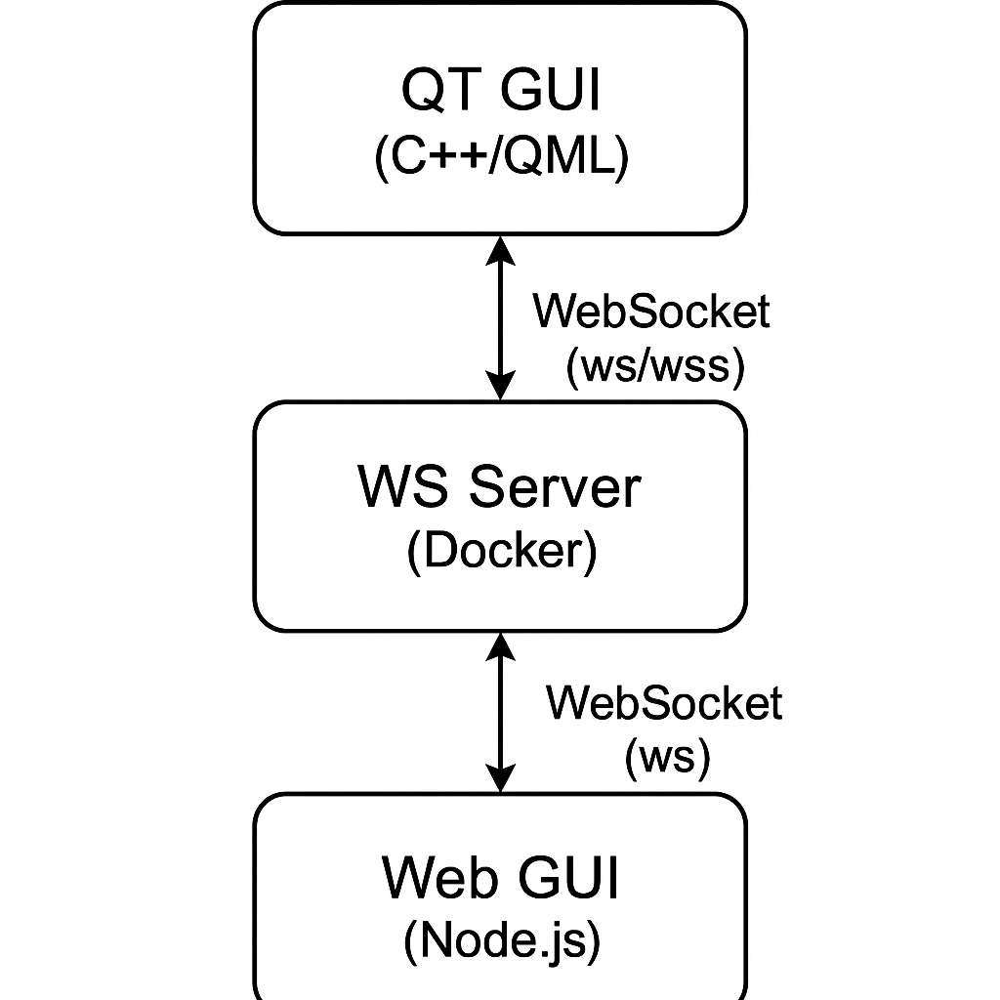

# PoC QT WebSockets

Proof of Concept between a QT5.13.2 project and WebSockets



## Prerequisites

1. Docker (for easy WebSockets server deployment). See how to install in [get-started](https://www.docker.com/get-started/)
2. Conan (easier c++ package management). See [conan 2 installation](https://docs.conan.io/2/installation.html)
3. Install NVM (Node Version Manager); see [freeCodeCamp tutorial](https://www.freecodecamp.org/news/node-version-manager-nvm-install-guide/).
4. Install Node (using NVM)

## Project structure

### PROJECT: QT Hello World

The QT Proof of Concept to showcase how to communicate publish/subscribe to WS.

```bash
app_qt/
├── src/                  # QT code base
│   ├── qml/              # QML code
│   │   ├── components/   # QML components
│   │   │   └── ...
│   │   └── main.qml      # Main QML source file
│   ├── state/            # App State atomic utilities
│   │   └── ...
│   ├── websockets/       # WebSockets communication files
│   │   └── ...
│   ├── main.cpp          # Main C++ source file
│   └── resources.qrc     # Qt resource collection file
├── CMakeLists.txt        # CMake build configuration file
├── compile.sh            # Compile script
├── conanfile.txt         # Conan dependency configuration
├── install.sh            # Install script
└── ...
```

#### QT Installation & Running

1. `cd app_qt`
2. `./install.sh`
3. `./compile.sh`
4. `./build/app_qt`

### PROJECT: WEB Server/Client

The Web Server to showcase how to communicate publish/subscribe to the Rex-Royal Websocket Server

```bash
app_web/
├── public/
│   └── public files
├── src/
│   └── web codebase
├── package.json
├── tsconfig.json
└── ...
```

#### WEB Installation & Running

Keep in mind that due to self-signed certification issues with the browser, the GUI only works with insecure websockets. To use secure WebSockets (wss), you need to assign a valid certificate to a domain and run the WebSocket server from there, updating the WebSocketConf.ts URL to point to that domain.

1. `cd app_web`
2. `npm install`
3. `npm run dev`

### PROJECT: Rex-Royal WebSocket Server

The WebSocket Server acts as a broker between all parties (Web GUI and QT Gui)

```bash
ws_server_cpp/
├── app/
│   └── docker specific files and certificate (self-signed) generation
├── src/
│   └── code base
├── .env # specifies if server will be `ws` or `wss`
├── Dockerfile
├── docker-compose.yaml
├── start.sh # starts docker service
├── stop.sh # stops docker service
└── ...
```

#### WebSocket Server Installation & Running

1. `cd ws_server_cpp`
2. `./start.sh`
3. `./stop.sh`

## Tying everything together (and testing SSL/NonSSL)

1. Run `rr_ws_server`

    ```bash
    cd ws_server_cpp
    ./app/compile.sh && ./build/rr_ws_server -p 3002 --secure --cert ./ssl/server.crt --key ./ssl/server.key
    # insecure
    ./app/compile.sh && ./build/rr_ws_server -p 3002
    ```

2. Run `app_qt`

    ```bash
    cd app_qt
    ./compile.sh && ./build/app_qt -w wss://localhost:3002
    # insecure
    ./compile.sh && ./build/app_qt -w ws://localhost:3002
    ```

3. If you have a true "let's encrypt" certificate on a proper domain, you can use the web server. If not, the web GUI will not work anymore. Here is how you test it using websocat, a [Rust project](https://www.rust-lang.org/tools/install):

    ```bash
    git clone https://github.com/vi/websocat.git
    cd websocat
    cargo build --release
    ./target/release/websocat wss://localhost:3002 --insecure
    ## you should have seen this message:
    {"action":"publish","payload":"Welcome! Your client ID is 29c89319","topic":"system"}

    ## while running websocat, you can also publish messages, just copy past the following:
    {"action":"SUBSCRIBE","topic":"CM_STATUS"}

    ## It should output:
    {"action":"subscribe","status":"success","topic":"CM_STATUS"}

    ## Now, if you change the "STATUS" counter or hit the "CM_STATUS" button, you should receive the following:
    {"action":"publish","payload":"3","timestamp":"2025-05-07T11:40:11","topic":"CM_STATUS"}
    {"action":"publish","payload":"4","timestamp":"2025-05-07T11:40:12","topic":"CM_STATUS"}
    {"action":"publish","payload":"5","timestamp":"2025-05-07T11:40:13","topic":"CM_STATUS"}

    ## You can also send messages the GUI can send like:
    {"action":"publish","topic":"GUI_READ_STATUS","payload":""}
    {"action":"publish","topic":"GUI_READ_STATUS"}

    ## Which will output
    {"action":"publish","payload":"4","timestamp":"2025-05-07T11:50:20","topic":"CM_STATUS"}
    ```
